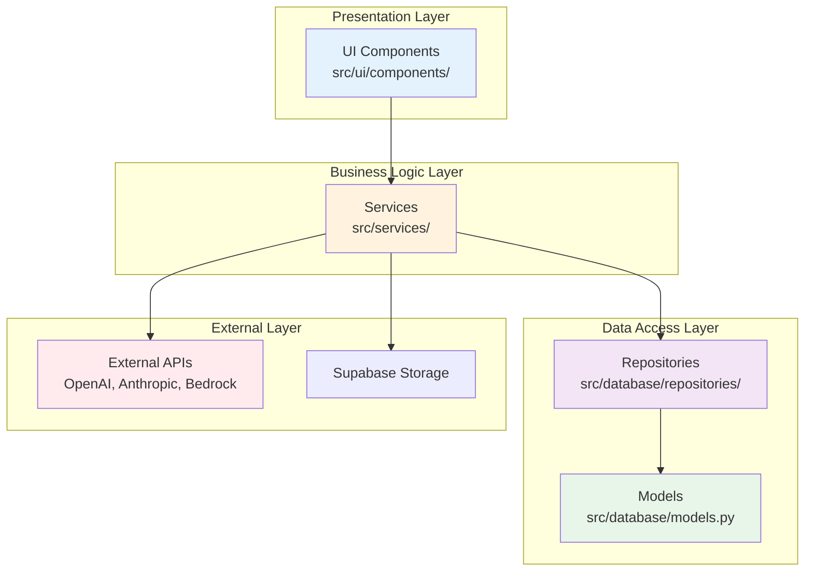
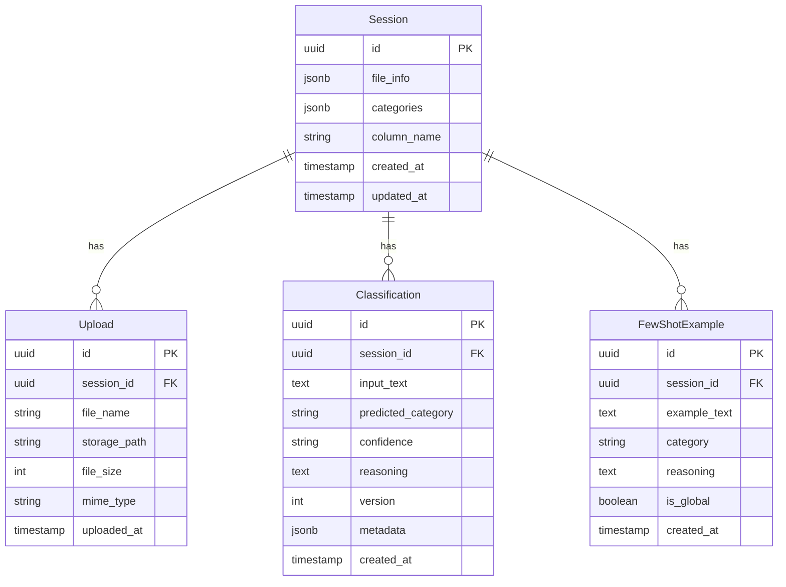
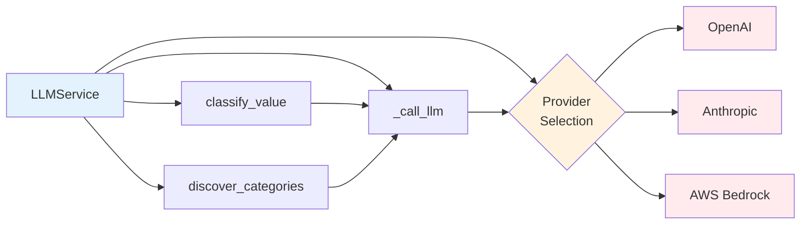
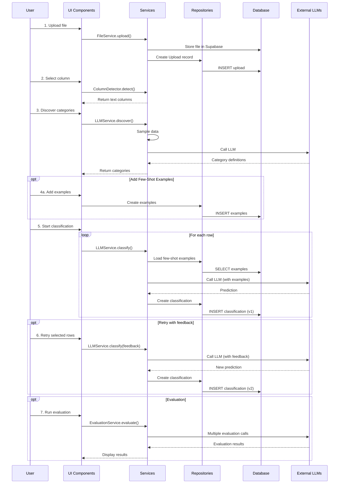

# Code Structure Documentation

Comprehensive guide to the codebase organization and architecture.

## Table of Contents
1. [Project Overview](#project-overview)
2. [Directory Structure](#directory-structure)
3. [Core Components](#core-components)
4. [Data Flow](#data-flow)
5. [Adding New Features](#adding-new-features)
6. [Design Patterns](#design-patterns)

---

## Project Overview

The Semantic Classifier follows a **layered architecture** pattern:



### Key Principles

1. **Separation of Concerns**: UI, business logic, and data access are separate
2. **Single Responsibility**: Each module has one clear purpose
3. **Dependency Injection**: Services receive dependencies rather than creating them
4. **Repository Pattern**: Abstract database operations behind repositories
5. **Service Layer**: All business logic centralized in services

---

## Directory Structure

```
testAlloBrainNew/
│
├── app.py                          # Main Streamlit application entry point
├── alembic.ini                     # Alembic configuration for migrations
├── requirements.txt                # Python dependencies
├── .env                           # Environment variables (not in git)
├── .env.example                   # Environment variables template
│
├── src/                           # Main source code directory
│   ├── __init__.py
│   ├── config.py                  # Configuration management
│   │
│   ├── database/                  # Database layer
│   │   ├── __init__.py
│   │   ├── models.py              # SQLAlchemy ORM models
│   │   ├── connection.py          # Database connection setup
│   │   │
│   │   └── repositories/          # Data access layer (Repository pattern)
│   │       ├── __init__.py
│   │       ├── session_repository.py
│   │       ├── upload_repository.py
│   │       ├── classification_repository.py
│   │       └── few_shot_example_repository.py
│   │
│   ├── services/                  # Business logic layer
│   │   ├── __init__.py
│   │   ├── llm_service.py         # LLM integration (multi-provider)
│   │   ├── evaluation_service.py  # Classification evaluation
│   │   └── file_service.py        # File processing and storage
│   │
│   ├── data_ingestion/            # Data processing utilities
│   │   ├── __init__.py
│   │   ├── file_parser.py         # CSV/Excel parsing
│   │   ├── data_sampler.py        # Stratified sampling
│   │   └── column_detector.py     # Text column detection
│   │
│   └── ui/                        # User interface layer
│       ├── __init__.py
│       └── components/            # Reusable Streamlit components
│           ├── __init__.py
│           ├── file_upload.py
│           ├── sheet_selector.py
│           ├── data_preview.py
│           ├── column_selector.py
│           ├── category_discovery.py
│           ├── classification_interface.py
│           ├── evaluation_interface.py
│           ├── model_selector.py
│           ├── few_shot_examples.py
│           └── session_manager.py
│
├── migrations/                    # Database migrations (Alembic)
│   ├── env.py
│   ├── script.py.mako
│   └── versions/
│       ├── 001_initial_schema.py
│       ├── 002_add_uploads_table.py
│       ├── 003_add_classification_version.py
│       └── 004_add_few_shot_examples.py
│
├── tests/                         # Test suite
│   ├── __init__.py
│   ├── conftest.py                # Shared fixtures
│   ├── test_few_shot_examples.py
│   └── ...
│
├── scripts/                       # Utility scripts
│   ├── run_tests.sh               # Test runner
│   └── ...
│
├── docs/                          # Documentation
│   ├── README.md                  # Setup guide
│   ├── TECHNICAL_ARCHITECTURE.md  # System architecture
│   ├── EVALUATION_FRAMEWORK.md    # Evaluation documentation
│   ├── CODE_STRUCTURE.md          # This file
│   ├── DATABASE_SCHEMA_REFERENCE.md
│   ├── COLUMN_DETECTION.md
│   └── STRUCTURE.md
│
├── subject/                       # Project requirements/specs
│   └── subject.md
│
└── plan/                         # Planning documents
    └── ...
```

---

## Core Components

### 1. Application Entry Point

#### `app.py`
Main Streamlit application that orchestrates the UI.

```python
# Key responsibilities:
- Initialize session state
- Check configuration
- Render sidebar with navigation
- Coordinate workflow steps (upload → classify → evaluate)
- Handle session management
```

**Important Functions**:
- `init_session_state()`: Initialize Streamlit session state
- `check_config()`: Validate API keys and configuration
- `render_sidebar()`: Render navigation and controls
- `main()`: Main application logic

---

### 2. Configuration Layer

#### `src/config.py`
Centralized configuration management using environment variables.

```python
class Config:
    # API Keys
    OPENAI_API_KEY: str
    ANTHROPIC_API_KEY: str

    # AWS Configuration
    AWS_ACCESS_KEY_ID: str
    AWS_SECRET_ACCESS_KEY: str
    AWS_REGION_NAME: str

    # Database
    DATABASE_URL: str
    SUPABASE_URL: str
    Supabase_api_key: str

    # Model Settings
    LLM_MODEL: str
    LLM_TEMPERATURE: float
    LLM_MAX_TOKENS: int

    # Data Processing
    MAX_PREVIEW_ROWS: int
    SAMPLE_SIZE: int
    MAX_TOKENS_FOR_SAMPLING: int

    @classmethod
    def validate() -> bool:
        """Validate required configuration"""
```

**Usage**:
```python
from src.config import Config

model = Config.LLM_MODEL
temperature = Config.LLM_TEMPERATURE
```

---

### 3. Database Layer

#### `src/database/models.py`
SQLAlchemy ORM models defining database schema.



**Key Models**:
- **Session**: Represents a classification session
- **Upload**: File upload metadata
- **Classification**: Classification results with versioning
- **FewShotExample**: Few-shot learning examples

#### `src/database/repositories/`
Repository pattern for data access.

**Benefits**:
- Abstracts database operations
- Enables easier testing (mock repositories)
- Centralizes data access logic
- Provides clean API for services

**Example: ClassificationRepository**:
```python
class ClassificationRepository:
    def create(self, classification_data: Dict) -> Classification:
        """Create new classification"""

    def get_by_session(self, session_id: UUID) -> List[Classification]:
        """Get all classifications for a session"""

    def get_latest_version(self, session_id: UUID, input_text: str) -> Optional[Classification]:
        """Get latest version of a classification"""

    def get_by_version(self, session_id: UUID, version: int) -> List[Classification]:
        """Get all classifications for a specific version"""
```

---

### 4. Service Layer

#### `src/services/llm_service.py`
Core service for LLM interactions.



**Key Methods**:
```python
class LLMService:
    def __init__(self, model: str = None):
        """Initialize with optional model override"""

    def discover_categories(
        self,
        sample_data: pd.DataFrame,
        column_name: str
    ) -> Dict:
        """Discover categories from sample data"""

    def classify_value(
        self,
        value: str,
        categories: List[Dict],
        column_name: str,
        few_shot_examples: List[Dict] = None,
        use_structured_output: bool = True
    ) -> Dict:
        """Classify a single value"""

    def _call_llm(
        self,
        messages: List[Dict],
        temperature: float = None,
        max_tokens: int = None,
        response_format: Dict = None
    ) -> str:
        """Internal: Call LLM with LiteLLM"""

    def _get_classification_schema(
        self,
        category_names: List[str]
    ) -> Dict:
        """Internal: Get structured output schema"""
```

**Design Decisions**:
- Uses **LiteLLM** for multi-provider support
- **Structured outputs** prevent category hallucination
- **Dynamic model selection** from session state
- **Temperature/max_tokens** configurable per call

#### `src/services/evaluation_service.py`
Evaluation logic without golden labels.

**Key Methods**:
```python
class EvaluationService:
    JUDGE_MODELS = {
        "openai_primary": "gpt-5.2-2025-12-11",
        "bedrock_opus_primary": "bedrock/global.anthropic.claude-opus-4-5-20251101-v1:0"
    }

    def self_consistency_evaluation(...) -> Dict:
        """Test classification robustness"""

    def generate_contrastive_examples(...) -> Dict:
        """Generate synthetic test examples"""

    def classify_generated_examples(...) -> Dict:
        """Classify and evaluate synthetic examples"""

    def llm_as_judge_evaluation(...) -> Dict:
        """Use strong models as judges"""
```

See [EVALUATION_FRAMEWORK.md](./EVALUATION_FRAMEWORK.md) for details.

#### `src/services/file_service.py`
File processing and Supabase storage.

**Key Methods**:
```python
class FileService:
    def upload_to_supabase(
        self,
        file_content: bytes,
        file_name: str
    ) -> str:
        """Upload file to Supabase Storage"""

    def download_from_supabase(self, storage_path: str) -> bytes:
        """Download file from Supabase Storage"""

    def process_file(self, uploaded_file) -> Dict:
        """Process uploaded file (CSV/Excel)"""
```

---

### 5. Data Ingestion Layer

#### `src/data_ingestion/file_parser.py`
Parse CSV and Excel files.

```python
class FileParser:
    @staticmethod
    def parse_csv(file_path: str) -> pd.DataFrame:
        """Parse CSV with encoding detection"""

    @staticmethod
    def parse_excel(file_path: str) -> Dict[str, pd.DataFrame]:
        """Parse Excel (returns dict of sheet_name -> DataFrame)"""
```

#### `src/data_ingestion/column_detector.py`
Detect text columns suitable for classification.

```python
class ColumnDetector:
    @staticmethod
    def detect_text_columns(df: pd.DataFrame) -> List[Dict]:
        """Detect columns that contain text suitable for classification

        Uses NLP metrics:
        - Average text length
        - Unique value ratio
        - Contains meaningful text (not just IDs)
        """
```

#### `src/data_ingestion/data_sampler.py`
Stratified sampling for category discovery.

```python
class DataSampler:
    @staticmethod
    def stratified_sample(
        df: pd.DataFrame,
        column: str,
        sample_size: int = 50
    ) -> pd.DataFrame:
        """Sample data ensuring diverse representation"""
```

---

### 6. UI Components Layer

Each UI component is a **reusable Streamlit function** that handles one workflow step.

#### Component Structure

```python
def render_component_name(
    # Input parameters (data, config, etc.)
) -> Optional[ReturnType]:
    """
    Component docstring

    Args:
        param1: Description
        param2: Description

    Returns:
        Return value description (or None if no return)
    """
    # 1. Display header/instructions
    st.header("Component Title")
    st.markdown("Instructions...")

    # 2. Initialize session state (if needed)
    if "component_state" not in st.session_state:
        st.session_state.component_state = initial_value

    # 3. Render UI controls (buttons, inputs, etc.)
    user_input = st.text_input("Label")

    # 4. Handle user actions
    if st.button("Action"):
        # Process action
        result = process_action(user_input)

        # Update session state
        st.session_state.component_state = result

        # Show feedback
        st.success("Action completed!")

        # Trigger rerun if needed
        st.rerun()

    # 5. Return result (if component produces output)
    return st.session_state.get("component_state")
```

#### Key Components

| Component | File | Purpose |
|-----------|------|---------|
| File Upload | `file_upload.py` | Handle file uploads, store in Supabase |
| Sheet Selector | `sheet_selector.py` | Select sheet from Excel workbook |
| Data Preview | `data_preview.py` | Display data preview with statistics |
| Column Selector | `column_selector.py` | Choose text column for classification |
| Category Discovery | `category_discovery.py` | AI-powered category discovery |
| Classification Interface | `classification_interface.py` | Batch classification with retry |
| Evaluation Interface | `evaluation_interface.py` | Multi-method evaluation |
| Model Selector | `model_selector.py` | Choose LLM model and settings |
| Few-Shot Examples | `few_shot_examples.py` | Manage few-shot learning examples |
| Session Manager | `session_manager.py` | Save/load sessions |

---

## Data Flow

### Complete Classification Flow



---

## Adding New Features

### Adding a New UI Component

1. **Create component file**: `src/ui/components/my_component.py`

```python
"""My Component - Description"""
import streamlit as st
from typing import Optional

def render_my_component(input_data) -> Optional[ReturnType]:
    """
    Render my component

    Args:
        input_data: Input description

    Returns:
        Output description
    """
    st.subheader("My Component")

    # Initialize state
    if "my_component_state" not in st.session_state:
        st.session_state.my_component_state = None

    # Render UI
    # ... your code ...

    return st.session_state.my_component_state
```

2. **Export from `__init__.py`**:

```python
# src/ui/components/__init__.py
from .my_component import render_my_component

__all__ = [
    # ... existing exports ...
    "render_my_component",
]
```

3. **Use in `app.py`**:

```python
from src.ui.components import render_my_component

result = render_my_component(data)
```

### Adding a New Service

1. **Create service file**: `src/services/my_service.py`

```python
"""My Service - Description"""
import logging
from typing import Dict, List

logger = logging.getLogger(__name__)

class MyService:
    """Service for doing X"""

    def __init__(self):
        """Initialize service"""
        self.config = Config

    def my_method(self, param: str) -> Dict:
        """
        Do something

        Args:
            param: Parameter description

        Returns:
            Result dictionary
        """
        try:
            # Implementation
            result = self._internal_method(param)
            return {"success": True, "result": result}
        except Exception as e:
            logger.error(f"Error in my_method: {e}")
            return {"success": False, "error": str(e)}

    def _internal_method(self, param: str):
        """Internal helper method"""
        pass
```

2. **Use in components or other services**:

```python
from src.services.my_service import MyService

service = MyService()
result = service.my_method("input")
```

### Adding a New Database Model

1. **Add model to `src/database/models.py`**:

```python
class MyModel(Base):
    """My model description"""
    __tablename__ = "my_table"

    id = Column(UUID(as_uuid=True), primary_key=True, default=uuid.uuid4)
    session_id = Column(UUID(as_uuid=True), ForeignKey("sessions.id"), nullable=False)
    my_field = Column(String(255), nullable=False)
    created_at = Column(DateTime, default=datetime.utcnow)

    # Relationships
    session = relationship("Session", back_populates="my_models")
```

2. **Create migration**:

```bash
alembic revision --autogenerate -m "add my_table"
```

3. **Review and apply migration**:

```bash
# Review generated migration in migrations/versions/
alembic upgrade head
```

4. **Create repository** (`src/database/repositories/my_repository.py`):

```python
class MyRepository:
    """Repository for MyModel"""

    def __init__(self, db_session):
        self.db = db_session

    def create(self, data: Dict) -> MyModel:
        """Create new record"""
        instance = MyModel(**data)
        self.db.add(instance)
        self.db.commit()
        self.db.refresh(instance)
        return instance

    def get_by_session(self, session_id: UUID) -> List[MyModel]:
        """Get all records for a session"""
        return self.db.query(MyModel)\
            .filter(MyModel.session_id == session_id)\
            .all()
```

---

## Design Patterns

### 1. Repository Pattern

**Purpose**: Abstract database operations

**Implementation**:
```python
# Instead of direct database access:
classification = Classification(session_id=id, ...)
db.add(classification)
db.commit()

# Use repository:
repo = ClassificationRepository(db)
classification = repo.create({"session_id": id, ...})
```

**Benefits**:
- Testable (mock repositories)
- Centralized data access logic
- Easy to change database implementation

### 2. Service Layer Pattern

**Purpose**: Centralize business logic

**Implementation**:
```python
# UI component stays thin:
def render_classification_interface(df, column, categories):
    if st.button("Classify"):
        service = LLMService()
        result = service.classify_value(value, categories, column)
        st.write(result)
```

**Benefits**:
- UI components focus on presentation
- Business logic reusable across components
- Easier to test business logic

### 3. Dependency Injection

**Purpose**: Reduce coupling, improve testability

**Implementation**:
```python
# Service receives dependencies:
class LLMService:
    def __init__(self, model: str = None, config: Config = None):
        self.model = model or Config.LLM_MODEL
        self.config = config or Config

# Easy to test with mocks:
service = LLMService(model="test-model", config=test_config)
```

### 4. Session State Management

**Purpose**: Persist state across Streamlit reruns

**Pattern**:
```python
# Initialize once
if "my_data" not in st.session_state:
    st.session_state.my_data = initial_value

# Read
current_value = st.session_state.my_data

# Update
st.session_state.my_data = new_value
```

**Best Practices**:
- Initialize in component, not globally
- Use descriptive key names
- Clear old state when starting new workflow

---

## Testing Strategy

### Unit Tests

Test individual functions/methods in isolation:

```python
# tests/test_column_detector.py
def test_detect_text_columns():
    df = pd.DataFrame({
        "text_col": ["long text here", "another text"],
        "id_col": [1, 2]
    })

    detector = ColumnDetector()
    result = detector.detect_text_columns(df)

    assert len(result) == 1
    assert result[0]["column"] == "text_col"
```

### Integration Tests

Test multiple components working together:

```python
# tests/test_classification_flow.py
def test_classification_with_few_shot():
    # Setup
    service = LLMService()
    example_repo = FewShotExampleRepository(db)

    # Add example
    example = example_repo.create({
        "example_text": "Test",
        "category": "Test Category"
    })

    # Classify
    result = service.classify_value(
        value="Test input",
        categories=[{"name": "Test Category"}],
        few_shot_examples=[example]
    )

    assert result["success"]
```

### Running Tests

```bash
# All tests
./scripts/run_tests.sh all

# Specific file
pytest tests/test_column_detector.py

# With coverage
./scripts/run_tests.sh coverage
```

---

## Performance Considerations

### Caching Strategies

1. **Session State**: Cache within user session
   ```python
   if "cached_data" not in st.session_state:
       st.session_state.cached_data = expensive_operation()
   ```

2. **Database**: Cache frequently accessed data
   ```python
   @lru_cache(maxsize=100)
   def get_categories(session_id: str):
       return repo.get_categories(session_id)
   ```

### Optimization Tips

1. **Batch Operations**: Classify multiple rows before database write
2. **Streaming**: Use Streamlit progress bars for long operations
3. **Sampling**: Use representative samples for discovery (not full dataset)
4. **Connection Pooling**: Reuse database connections

---

## Further Reading

- [Technical Architecture](./TECHNICAL_ARCHITECTURE.md) - High-level system design
- [Evaluation Framework](./EVALUATION_FRAMEWORK.md) - Evaluation methods
- [Database Schema](./DATABASE_SCHEMA_REFERENCE.md) - Database structure
- [Setup Guide](./README.md) - Getting started

---

**Version**: 1.0
**Last Updated**: 2026-02-02
