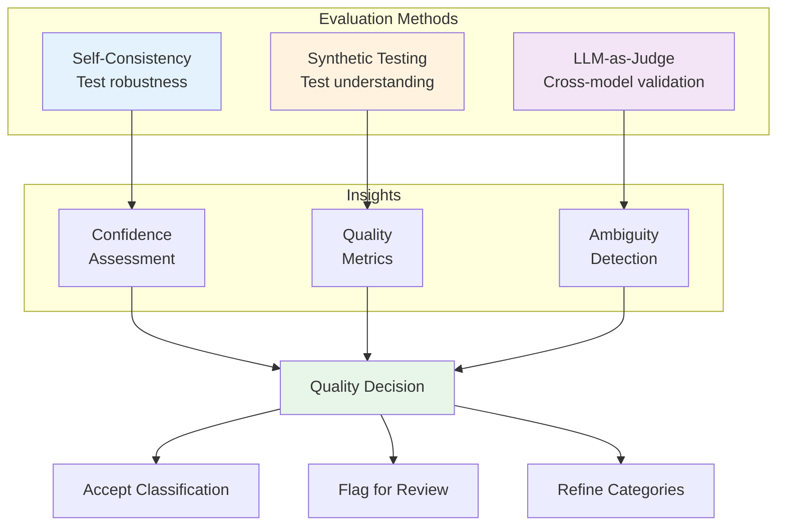
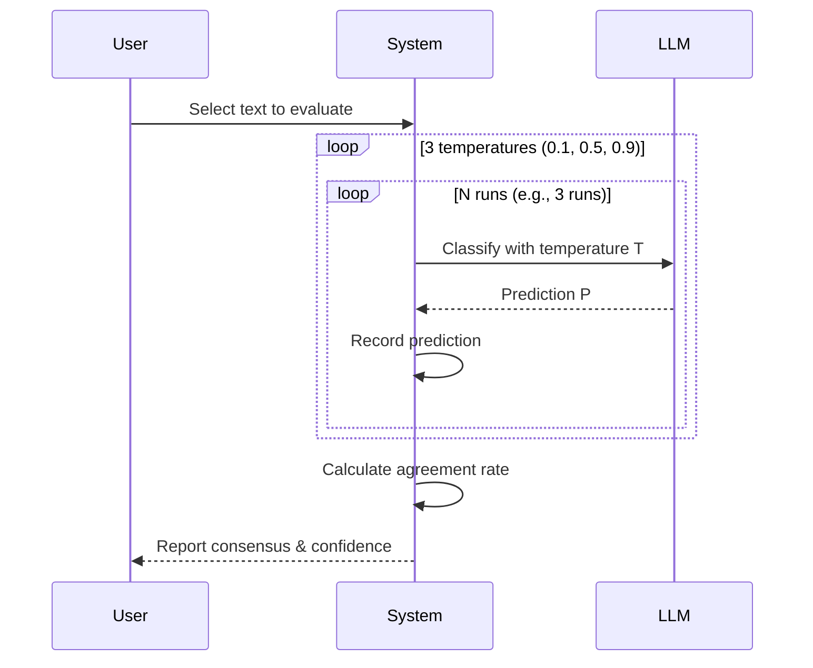
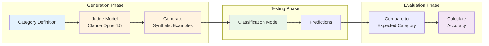
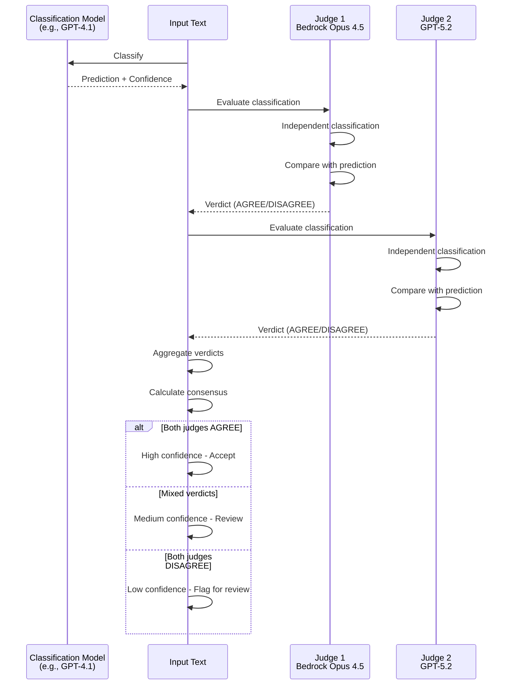
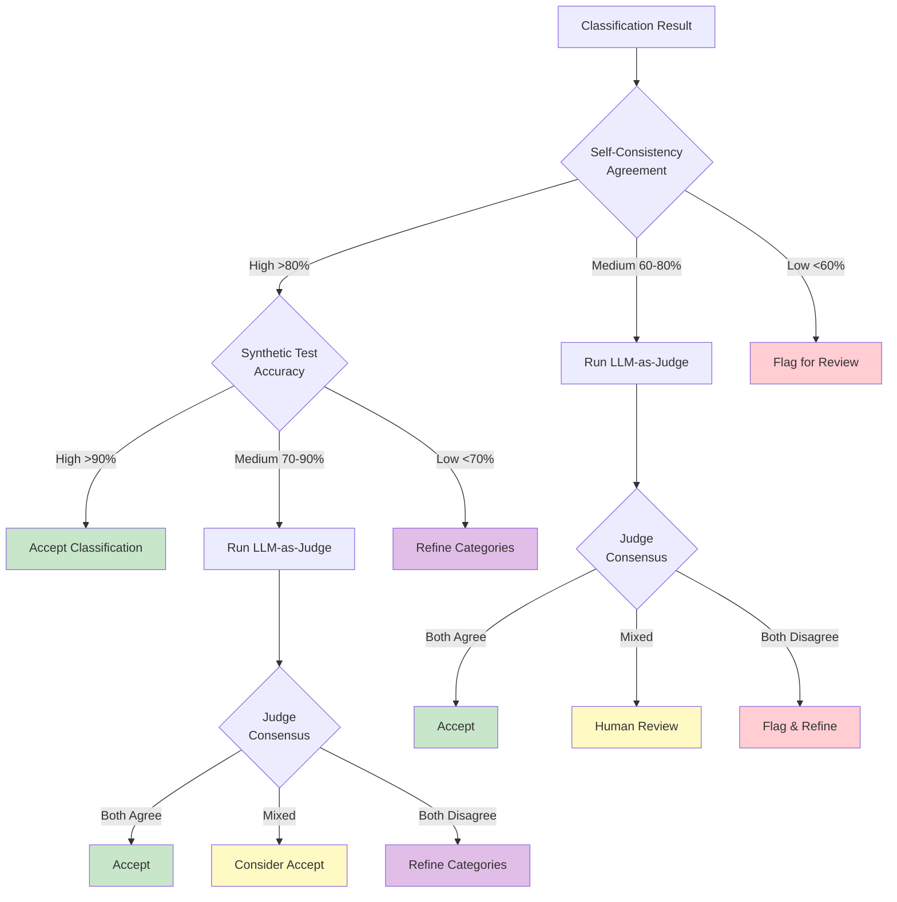
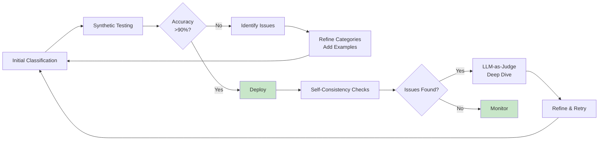

# Evaluation Framework Documentation

Comprehensive guide to evaluating classification quality without golden labels.

## Table of Contents
1. [Overview](#overview)
2. [Evaluation Methods](#evaluation-methods)
3. [Implementation Guide](#implementation-guide)
4. [Interpreting Results](#interpreting-results)
5. [Best Practices](#best-practices)

---

## Overview

### The Challenge

Traditional machine learning evaluation requires labeled test data (golden labels). In many real-world scenarios:
- **No labeled data exists** - New classification tasks without historical labels
- **Labeling is expensive** - Manual annotation requires significant time/cost
- **Data distribution shifts** - Historical labels may not reflect current data

### Our Solution

We implement three complementary evaluation methods that work **without labeled data**:



---

## Evaluation Methods

### 1. Self-Consistency Evaluation

**Principle**: Robust predictions remain stable across different model temperatures.

#### How It Works



#### Algorithm

1. **Select input**: Choose a classified text sample
2. **Multiple temperatures**: Test with varying randomness:
   - **T=0.1**: Very deterministic (focused)
   - **T=0.5**: Balanced
   - **T=0.9**: More random (creative)
3. **Multiple runs**: Classify same input multiple times per temperature
4. **Calculate consensus**: Count most frequent prediction
5. **Agreement rate**: Percentage of runs producing consensus prediction

#### Interpretation

| Agreement Rate | Confidence Level | Action |
|----------------|------------------|--------|
| ≥ 80% | **High** | Accept classification |
| 60-80% | **Medium** | Consider human review |
| < 60% | **Low** | Flag for review or refine categories |

#### Example Results

```python
{
    "total_runs": 9,
    "predictions": {
        "Technical Support": 7,
        "Sales Inquiry": 2
    },
    "most_common_prediction": "Technical Support",
    "agreement_rate": 0.78,  # 78%
    "confidence_level": "medium",
    "recommendation": "Medium confidence - some uncertainty, consider human review"
}
```

#### When to Use

- ✅ **Testing edge cases** - Borderline classifications
- ✅ **Confidence calibration** - Understanding model certainty
- ✅ **Category boundary validation** - Finding ambiguous boundaries
- ❌ Not suitable for: High-volume testing (API costs)

---

### 2. Synthetic Testing

**Principle**: Models should correctly classify examples they generate for each category.

#### How It Works



#### Algorithm

1. **Select category**: Choose a category to test
2. **Generate examples**: Use strong model (Opus 4.5) to create realistic examples:
   ```
   Prompt: "Generate 5 examples that belong to category X.
   Include easy, medium, and hard examples."
   ```
3. **Classify generated examples**: Run classification model on examples
4. **Calculate accuracy**: Percentage of examples classified to correct category
5. **Analyze errors**: Identify patterns in misclassifications

#### Difficulty Levels

Examples are generated with varying difficulty:
- **Easy**: Obvious category indicators, clear language
- **Medium**: Some ambiguity, requires context understanding
- **Hard**: Edge cases, subtle distinctions, borderline examples

#### Interpretation

| Accuracy | Quality Assessment | Action |
|----------|-------------------|--------|
| ≥ 90% | **Excellent** | Category well-defined |
| 70-90% | **Moderate** | Refine category definitions |
| < 70% | **Poor** | Review category boundaries |

#### Example Results

```python
{
    "category": "Technical Support",
    "total_examples": 5,
    "correct": 4,
    "accuracy": 80.0,
    "quality_assessment": "Moderate - Needs refinement",
    "results": [
        {
            "text": "How do I reset my password?",
            "difficulty": "easy",
            "expected": "Technical Support",
            "predicted": "Technical Support",
            "correct": True
        },
        {
            "text": "My account was charged twice",
            "difficulty": "hard",
            "expected": "Technical Support",
            "predicted": "Billing Inquiry",
            "correct": False
        }
    ]
}
```

#### When to Use

- ✅ **Category validation** - Testing if categories are learnable
- ✅ **Boundary testing** - Finding category overlap issues
- ✅ **Systematic testing** - Testing all categories consistently
- ✅ **Pre-deployment** - Before running full classification

---

### 3. LLM-as-Judge Evaluation

**Principle**: Stronger, more capable models can evaluate decisions from classification models.

#### How It Works



#### Judge Models

We use the most capable models as judges:
- **Bedrock Opus 4.5** (Global): Most capable Claude model via AWS
- **GPT-5.2**: Latest OpenAI flagship model

These models are stronger than typical classification models (GPT-4.1, Claude Sonnet).

#### Algorithm

1. **Classification**: Get prediction from classification model
2. **Independent evaluation**: Each judge model:
   - Sees the input text and available categories
   - Makes independent classification (without bias)
   - Compares their decision to classifier's prediction
   - Provides verdict: AGREE, DISAGREE, or PARTIALLY_AGREE
   - Explains reasoning
   - Rates reasoning quality (1-5)
   - Provides judge confidence score (0.0-1.0)
3. **Aggregate**: Combine judge verdicts into consensus
4. **Final verdict**: Based on agreement level

#### Judge Prompt Structure

```
You are an expert evaluator. Evaluate if the classifier made the correct decision.

Text to classify: "{input_text}"
Column: {column_name}

Available categories:
- Category 1: Description
- Category 2: Description
...

Classifier's prediction: {predicted_category}
Classifier's confidence: {confidence}
Classifier's reasoning: {reasoning}

Your task:
1. Independently classify this text (without bias from the classifier's choice)
2. Evaluate if you agree with the classifier
3. Rate the quality of classification

Respond in JSON format:
{
  "independent_classification": "your category choice",
  "agreement": "AGREE" | "DISAGREE" | "PARTIALLY_AGREE",
  "correct_category": "category name if you disagree, null otherwise",
  "reasoning_quality": 1-5,
  "issues_identified": ["issue1", "issue2"],
  "judge_confidence": 0.0-1.0,
  "explanation": "your reasoning"
}
```

#### Consensus Interpretation

| Agreement Pattern | Consensus | Interpretation |
|------------------|-----------|----------------|
| Both AGREE | **Strong consensus** | Classification highly likely correct |
| 1 AGREE, 1 PARTIALLY_AGREE | **Moderate consensus** | Acceptable, but some ambiguity |
| 1 AGREE, 1 DISAGREE | **Split decision** | Genuinely ambiguous case |
| Both DISAGREE | **Strong disagreement** | Classification likely incorrect |

#### Example Results

```python
{
    "text": "How do I upgrade my subscription?",
    "predicted_category": "Technical Support",
    "total_judges": 2,
    "agreement_count": 1,
    "agreement_rate": 0.5,
    "consensus": "Mixed opinions - genuinely ambiguous",
    "judge_results": [
        {
            "judge_name": "bedrock_opus_primary",
            "independent_classification": "Billing Inquiry",
            "agreement": "DISAGREE",
            "correct_category": "Billing Inquiry",
            "reasoning_quality": 4,
            "judge_confidence": 0.7,
            "explanation": "Upgrading subscription is primarily a billing action..."
        },
        {
            "judge_name": "openai_primary",
            "independent_classification": "Technical Support",
            "agreement": "AGREE",
            "reasoning_quality": 4,
            "judge_confidence": 0.6,
            "explanation": "Could be interpreted as needing technical guidance..."
        }
    ],
    "final_verdict": "Classification questionable - review needed"
}
```

#### When to Use

- ✅ **High-stakes decisions** - Important classifications need validation
- ✅ **Ambiguous cases** - When classifier confidence is low
- ✅ **Random sampling** - Quality spot-checks
- ✅ **Category refinement** - Finding systematic issues
- ❌ Not suitable for: Full dataset evaluation (cost-prohibitive)

---

## Implementation Guide

### Running Self-Consistency Evaluation

```python
from src.services.evaluation_service import EvaluationService

eval_service = EvaluationService()

result = eval_service.self_consistency_evaluation(
    text="How do I reset my password?",
    categories=categories,
    column_name="support_ticket",
    temperatures=[0.1, 0.5, 0.9],
    num_runs=3
)

print(f"Agreement Rate: {result['agreement_rate']:.0%}")
print(f"Confidence: {result['confidence_level']}")
print(f"Recommendation: {result['recommendation']}")
```

### Running Synthetic Testing

```python
# Generate examples for a category
gen_result = eval_service.generate_contrastive_examples(
    category={
        "name": "Technical Support",
        "description": "Customer needs technical help",
        "boundary": "Excludes billing questions"
    },
    num_examples=5,
    difficulty_levels=["easy", "medium", "hard"]
)

# Classify generated examples
if gen_result["success"]:
    class_result = eval_service.classify_generated_examples(
        generated_examples=gen_result["examples"],
        categories=categories,
        column_name="support_ticket",
        expected_category="Technical Support"
    )

    print(f"Accuracy: {class_result['accuracy']:.1f}%")
    print(f"Quality: {class_result['quality_assessment']}")
```

### Running LLM-as-Judge

```python
result = eval_service.llm_as_judge_evaluation(
    text="How do I upgrade my subscription?",
    predicted_category="Technical Support",
    categories=categories,
    column_name="support_ticket",
    confidence="medium",
    reasoning="User is asking about account changes",
    use_cross_model=True  # Use both judges
)

print(f"Agreement Rate: {result['agreement_rate']:.0%}")
print(f"Consensus: {result['consensus']}")
print(f"Final Verdict: {result['final_verdict']}")
```

---

## Interpreting Results

### Decision Matrix

Use this matrix to decide on actions based on evaluation results:



### Combined Insights

Best practice is to use multiple methods together:

#### Scenario 1: High Confidence
- Self-Consistency: 90% agreement
- Synthetic Test: 95% accuracy
- **Action**: Accept classification, no further validation needed

#### Scenario 2: Moderate Confidence
- Self-Consistency: 70% agreement
- Synthetic Test: 85% accuracy
- **Action**: Run LLM-as-Judge on sample for spot-check

#### Scenario 3: Low Confidence
- Self-Consistency: 50% agreement
- Synthetic Test: 65% accuracy
- **Action**: Review category definitions, add few-shot examples

#### Scenario 4: Contradictory Signals
- Self-Consistency: 85% agreement (high)
- Synthetic Test: 60% accuracy (low)
- **Interpretation**: Model is consistent but category definition may be unclear
- **Action**: Refine category boundaries, add examples

---

## Best Practices

### Sampling Strategy

**For Self-Consistency**:
- Focus on borderline cases (medium confidence)
- Test representative samples from each category
- Prioritize high-stakes classifications

**For Synthetic Testing**:
- Test all categories systematically
- Generate diverse difficulty levels
- Use before full classification run

**For LLM-as-Judge**:
- Sample 5-10 examples per category
- Include mix of high and low confidence predictions
- Prioritize disagreements from other methods

### Cost Optimization

| Method | API Calls | Relative Cost | When to Use |
|--------|-----------|---------------|-------------|
| Self-Consistency | 9-15 per sample | Medium | Spot checks |
| Synthetic Testing | 5-10 per category | Medium | Pre-deployment |
| LLM-as-Judge | 2-3 per sample | High | Final validation |

**Cost-Effective Approach**:
1. Run synthetic testing on all categories (one-time, ~10-50 calls)
2. Self-consistency on 10-20 representative samples (~100-300 calls)
3. LLM-as-Judge on flagged cases only (~10-30 calls)

### Iterative Improvement Workflow



### Quality Benchmarks

Aim for these targets:

| Metric | Target | Good | Acceptable | Needs Work |
|--------|--------|------|------------|------------|
| Self-Consistency Agreement | >85% | >75% | >60% | <60% |
| Synthetic Test Accuracy | >95% | >85% | >70% | <70% |
| LLM-as-Judge Agreement | 100% | >80% | >50% | <50% |

---

## Troubleshooting

### Low Self-Consistency

**Symptoms**: Agreement rate <60%

**Possible Causes**:
- Categories too similar or overlapping
- Input text genuinely ambiguous
- Category definitions unclear

**Solutions**:
1. Review category boundaries
2. Add few-shot examples for clarity
3. Consider splitting/merging categories
4. Add more specific category descriptions

### Low Synthetic Test Accuracy

**Symptoms**: Accuracy <70%

**Possible Causes**:
- Category definitions don't match model's understanding
- Generated examples don't represent real data
- Classification model not suitable for task

**Solutions**:
1. Refine category descriptions with examples
2. Adjust category boundaries
3. Use stronger classification model
4. Add few-shot examples from real data

### Judge Disagreement

**Symptoms**: Judges consistently disagree

**Possible Causes**:
- Truly ambiguous classifications
- Category overlap
- Subjective categorization task

**Solutions**:
1. Review specific disagreement patterns
2. Refine ambiguous categories
3. Consider multi-label classification
4. Consult domain expert

---

## API Reference

### EvaluationService

```python
class EvaluationService:
    """Service for evaluating classification quality"""

    def self_consistency_evaluation(
        self,
        text: str,
        categories: List[Dict],
        column_name: str,
        temperatures: List[float] = [0.1, 0.5, 0.9],
        num_runs: int = 3
    ) -> Dict

    def generate_contrastive_examples(
        self,
        category: Dict,
        num_examples: int = 5,
        difficulty_levels: List[str] = ["easy", "medium", "hard"]
    ) -> Dict

    def classify_generated_examples(
        self,
        generated_examples: List[Dict],
        categories: List[Dict],
        column_name: str,
        expected_category: str
    ) -> Dict

    def llm_as_judge_evaluation(
        self,
        text: str,
        predicted_category: str,
        categories: List[Dict],
        column_name: str,
        confidence: Optional[str] = None,
        reasoning: Optional[str] = None,
        use_cross_model: bool = True
    ) -> Dict
```

---

## Further Reading

- [Technical Architecture](./TECHNICAL_ARCHITECTURE.md) - System design overview
- [Setup Guide](./README.md) - Getting started
- [Code Structure](./CODE_STRUCTURE.md) - Codebase organization

---

**Version**: 1.0
**Last Updated**: 2026-02-02
