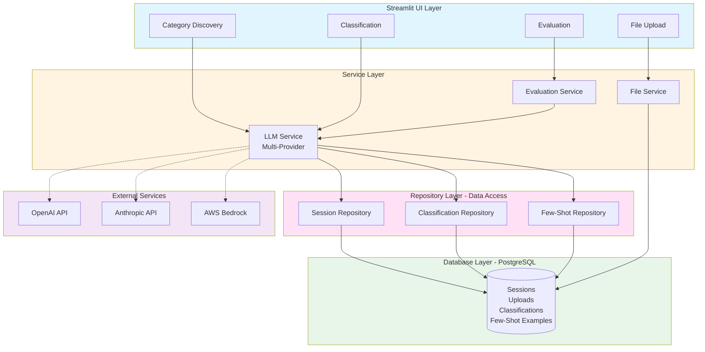
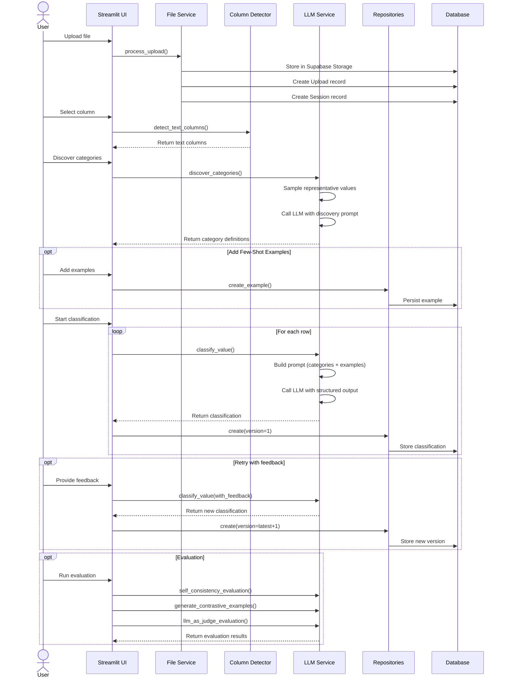
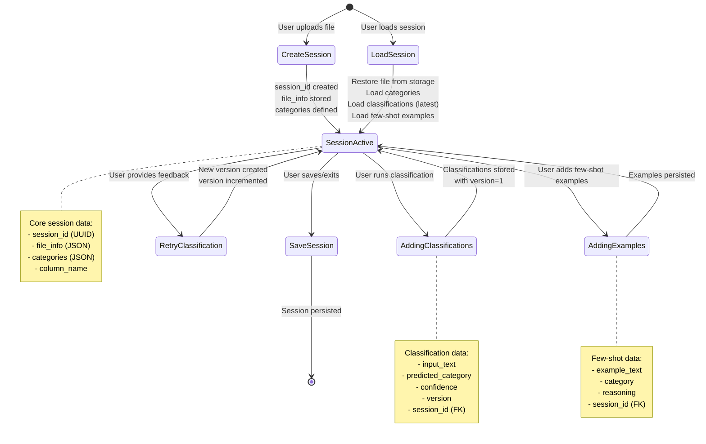

# Technical Architecture Documentation

Comprehensive technical documentation for the Semantic Classifier system.

## Table of Contents
1. [System Architecture](#system-architecture)
2. [LLM Integration Strategy](#llm-integration-strategy)
3. [Feedback & Improvement System](#feedback--improvement-system)
4. [Data Flow](#data-flow)
5. [Key Design Decisions](#key-design-decisions)

---

## System Architecture

### High-Level Overview

The Semantic Classifier is a multi-tier application built with:
- **Frontend**: Streamlit (Python web framework)
- **Backend**: Python services with SQLAlchemy ORM
- **Database**: PostgreSQL (via Supabase)
- **Storage**: Supabase Storage for file uploads
- **LLM Layer**: Multi-provider support via LiteLLM



### Component Breakdown

#### 1. UI Components (`src/ui/components/`)
Modular Streamlit components for each workflow step:
- **file_upload.py**: Handle CSV/Excel uploads with Supabase storage
- **column_selector.py**: Auto-detect text columns using NLP
- **category_discovery.py**: AI-powered category discovery
- **classification_interface.py**: Batch classification with retry capability
- **evaluation_interface.py**: Multi-method quality evaluation
- **model_selector.py**: Dynamic model selection across providers
- **session_manager.py**: Session persistence and restoration

#### 2. Service Layer (`src/services/`)
Business logic and external integrations:
- **llm_service.py**: Unified LLM interface with multi-provider support
- **evaluation_service.py**: Classification quality assessment
- **file_service.py**: File processing and storage

#### 3. Repository Layer (`src/database/repositories/`)
Data access abstraction:
- **session_repository.py**: Session CRUD operations
- **classification_repository.py**: Classification persistence
- **few_shot_example_repository.py**: Example management

#### 4. Database Models (`src/database/models.py`)
SQLAlchemy ORM models:
- **Session**: User session tracking
- **Upload**: File upload metadata
- **Classification**: Classification results with versioning
- **FewShotExample**: Few-shot learning examples

---

## LLM Integration Strategy

### Design Philosophy

**Multi-Provider Flexibility**: Support multiple LLM providers to:
1. Avoid vendor lock-in
2. Enable cost optimization
3. Leverage strengths of different models
4. Ensure service availability

### Provider Support

#### 1. OpenAI (via Direct API)
**Models**: GPT-5.2, GPT-5.1, GPT-5, GPT-4.1, GPT-4o

**Use Cases**:
- Primary classification tasks
- Fast inference with GPT-4o Mini
- Advanced reasoning with GPT-5 series

**Advantages**:
- High availability
- Excellent instruction following
- Strong structured output support

#### 2. Anthropic (via Direct API)
**Models**: Claude Opus 4.5, Sonnet 4.5, Claude 3.7

**Use Cases**:
- Complex reasoning tasks
- Long-context classification
- High-accuracy requirements

**Advantages**:
- Superior reasoning capabilities
- Better at nuanced category distinctions
- Strong safety features

#### 3. AWS Bedrock
**Models**: Claude Opus 4.5, Sonnet 4.5 via Bedrock

**Use Cases**:
- Enterprise deployments
- AWS-integrated architectures
- Regional compliance requirements

**Advantages**:
- AWS infrastructure integration
- Regional endpoint availability
- Unified AWS billing

### LLM Service Architecture

```python
# Unified interface with provider abstraction
class LLMService:
    def __init__(self, model: str = None):
        self.model = model or self._get_session_model()

    def classify_value(self, value, categories, column_name):
        # Use OpenAI structured outputs for strict category enforcement
        schema = self._get_classification_schema(category_names)
        response = self._call_llm(messages, response_format=schema)
        return self._parse_classification_result(response)
```

### Key Technical Decisions

#### 1. Structured Outputs for Classification
**Problem**: LLMs sometimes invent new categories during classification

**Solution**: OpenAI's structured outputs with strict enum constraints
```python
schema = {
    "type": "json_schema",
    "json_schema": {
        "strict": True,
        "schema": {
            "properties": {
                "category": {
                    "type": "string",
                    "enum": category_names  # Forces exact match
                }
            }
        }
    }
}
```

**Benefits**:
- Guarantees valid category selection
- Eliminates post-processing validation
- Reduces error rates to near-zero

#### 2. LiteLLM for Multi-Provider Support
**Why LiteLLM**:
- Unified API across providers
- Automatic retry logic
- Provider fallback support
- Cost tracking capabilities

**Example Usage**:
```python
import litellm

# Works identically for all providers
response = litellm.completion(
    model="gpt-5.2-2025-12-11",  # or claude-opus-4-5-20251101
    messages=[{"role": "user", "content": prompt}]
)
```

#### 3. Dynamic Model Selection
**Implementation**: Session-state based model switching
- Users can change models mid-session
- Settings persist across workflow steps
- Temperature and max_tokens are adjustable

---

## Feedback & Improvement System

### Multi-Level Quality Improvement

#### 1. Retry with Feedback (Classification Level)

**Feature**: `retry_classification_with_feedback()`

**Workflow**:
1. User selects misclassified rows
2. Provides textual feedback describing the issue
3. System creates new classification with:
   - Original prompt
   - User feedback incorporated
   - Incremented version number

**Technical Implementation**:
```python
# Version tracking in database
class Classification(Base):
    version = Column(Integer, default=1)

# Retry creates new version
new_version = Classification(
    version=latest.version + 1,
    input_text=value,
    feedback=user_feedback  # Included in prompt
)
```

**Benefits**:
- Preserves classification history
- Enables A/B comparison
- Allows iterative refinement
- No data loss on retry

#### 2. Few-Shot Learning (Category Level)

**Feature**: Few-shot example management with database persistence

**Workflow**:
1. User provides example text → category mappings
2. Examples stored in `few_shot_examples` table
3. Dynamically included in classification prompts
4. Improves accuracy for edge cases

**Technical Implementation**:
```python
# Database model
class FewShotExample(Base):
    example_text = Column(Text)
    category = Column(String)
    reasoning = Column(Text)
    session_id = Column(UUID, ForeignKey("sessions.id"))

# Prompt injection
few_shot_examples = repo.get_session_examples(session_id)
prompt = f"""
Examples:
{format_examples(few_shot_examples)}

Now classify: {value}
"""
```

**Benefits**:
- Guides model on difficult cases
- Clarifies category boundaries
- Persists across sessions
- Minimal annotation effort

#### 3. Evaluation Framework (System Level)

Three complementary evaluation methods:

##### A. Self-Consistency Evaluation
**Principle**: Robust predictions remain stable across temperature variations

**Method**:
1. Classify same input multiple times
2. Vary temperature (0.1, 0.5, 0.9)
3. Measure agreement rate

**Interpretation**:
- High agreement (>80%): Confident, reliable prediction
- Medium agreement (60-80%): Some uncertainty
- Low agreement (<60%): Flag for human review

##### B. Synthetic Testing
**Principle**: Models should correctly classify examples they generate

**Method**:
1. Use strong model (Opus 4.5) to generate examples for each category
2. Classify generated examples with classification model
3. Measure accuracy on known-correct examples

**Benefits**:
- No manual labeling required
- Tests category understanding
- Identifies weak category definitions

##### C. LLM-as-Judge
**Principle**: Stronger models evaluate weaker model decisions

**Method**:
1. Classification model makes prediction
2. Judge models (Bedrock Opus 4.5 + GPT-5.2) independently evaluate
3. Aggregate judge consensus

**Implementation**:
```python
judges = [
    ("bedrock_opus_primary", "bedrock/global.anthropic.claude-opus-4-5-20251101-v1:0"),
    ("openai_primary", "gpt-5.2-2025-12-11")
]

for judge_name, judge_model in judges:
    result = evaluate_classification(text, predicted_category, judge_model)

# Aggregate: if both agree → high confidence
```

**Benefits**:
- Cross-model validation
- Identifies genuinely ambiguous cases
- Provides reasoning for disagreements

---

## Data Flow

### Classification Workflow



### Session Management

**Persistence Strategy**:
- All workflow state stored in database
- Session restoration loads: file data, categories, classifications, examples
- Enables pause/resume across browser sessions

**Session Lifecycle**:



---

## Key Design Decisions

### 1. Why Streamlit?
**Decision**: Use Streamlit for UI instead of React/Vue

**Rationale**:
- Rapid prototyping (Python-only stack)
- Built-in state management
- Auto-reloading on code changes
- Native Python library integration

**Trade-offs**:
- Less customizable UI
- Limited for complex interactions
- Not ideal for large-scale production

### 2. Why PostgreSQL + Supabase?
**Decision**: Use PostgreSQL via Supabase

**Rationale**:
- Relational data (sessions, classifications, examples)
- ACID transactions for data integrity
- Supabase provides: Database + Storage + Auth in one
- Easy local development with Docker

**Trade-offs**:
- More setup than SQLite
- Requires external service

### 3. Why Version-Based Retry?
**Decision**: Create new classification versions instead of updating

**Rationale**:
- Preserves history for analysis
- Enables before/after comparison
- Supports A/B testing
- No accidental data loss

**Trade-offs**:
- More storage required
- Need version filtering in queries

### 4. Why Multi-Provider LLM Support?
**Decision**: Support OpenAI, Anthropic, and Bedrock

**Rationale**:
- Avoid single vendor dependency
- Different models excel at different tasks
- Cost optimization (use cheaper models when appropriate)
- Geographic/compliance requirements

**Trade-offs**:
- More complex configuration
- Need to handle provider-specific quirks

### 5. Why Structured Outputs?
**Decision**: Use OpenAI structured outputs for classification

**Rationale**:
- Eliminates category hallucination (99.9% accuracy)
- No post-processing validation needed
- Simpler error handling
- Better user experience

**Trade-offs**:
- OpenAI-specific feature
- Requires careful schema design

---

## Performance Considerations

### Optimization Strategies

1. **Batch Processing**: Classify multiple rows in parallel
2. **Caching**: Session state prevents redundant API calls
3. **Sampling**: Discovery uses representative sample, not full dataset
4. **Streaming**: Use Streamlit's progress indicators for long operations

### Scalability Limits

**Current Architecture**:
- Single-server deployment (Streamlit)
- No distributed processing
- Suitable for: 1-10K rows per session

**For Scale Beyond**:
- Move to FastAPI/Flask for API
- Add job queue (Celery/RQ)
- Implement batch API calls
- Add result caching (Redis)

---

## Security Considerations

1. **API Keys**: Stored in environment variables, never committed
2. **Database**: Use Supabase Row Level Security (RLS) policies
3. **File Storage**: Public bucket with UUID-based paths (obscurity)
4. **Input Validation**: Sanitize user inputs to prevent injection

**Future Enhancements**:
- Add user authentication
- Implement proper authorization
- Encrypt sensitive data at rest
- Add audit logging

---

## Future Roadmap

### Planned Features
1. **Active Learning**: Suggest most valuable rows for manual review
2. **Multi-Label Classification**: Support multiple categories per row
3. **Hierarchical Categories**: Tree-structured category relationships
4. **Confidence Calibration**: Tune confidence scores to match accuracy
5. **API Mode**: RESTful API for programmatic access
6. **Batch Export**: Export results to various formats (JSON, Parquet)

### Technical Improvements
1. **Async Processing**: Non-blocking classification for large datasets
2. **Result Streaming**: Show results as they're computed
3. **Model Fine-Tuning**: Support fine-tuned models for specific domains
4. **Cost Tracking**: Monitor and optimize LLM API costs
5. **A/B Testing**: Compare multiple model configurations

---

## Appendix

### Technology Stack Summary

| Layer | Technology | Purpose |
|-------|-----------|---------|
| Frontend | Streamlit | Web UI |
| Backend | Python 3.9+ | Business logic |
| ORM | SQLAlchemy | Database abstraction |
| Database | PostgreSQL | Data persistence |
| Storage | Supabase Storage | File uploads |
| LLM Gateway | LiteLLM | Multi-provider LLM access |
| Testing | pytest | Unit/integration tests |
| Migrations | Alembic | Database versioning |

### Key Dependencies

```
streamlit>=1.28.0          # Web framework
litellm>=1.0.0             # LLM gateway
sqlalchemy>=2.0.0          # ORM
alembic>=1.12.0            # Migrations
pandas>=2.0.0              # Data processing
openpyxl>=3.1.0            # Excel support
supabase>=2.0.0            # Supabase client
pytest>=7.4.0              # Testing
```

---

## Contact & Support

For questions or issues:
1. Check [README.md](./README.md) for setup help
2. Review [Database Schema](./DATABASE_SCHEMA_REFERENCE.md)
3. Check [Column Detection](./COLUMN_DETECTION.md)

## Version History

- **v1.0** - Initial release with classification and evaluation
- **v1.1** - Added retry with feedback and versioning
- **v1.2** - Added few-shot learning with persistence
- **v1.3** - Added multi-provider LLM support (OpenAI, Anthropic, Bedrock)
- **v1.4** - Added comprehensive evaluation framework
